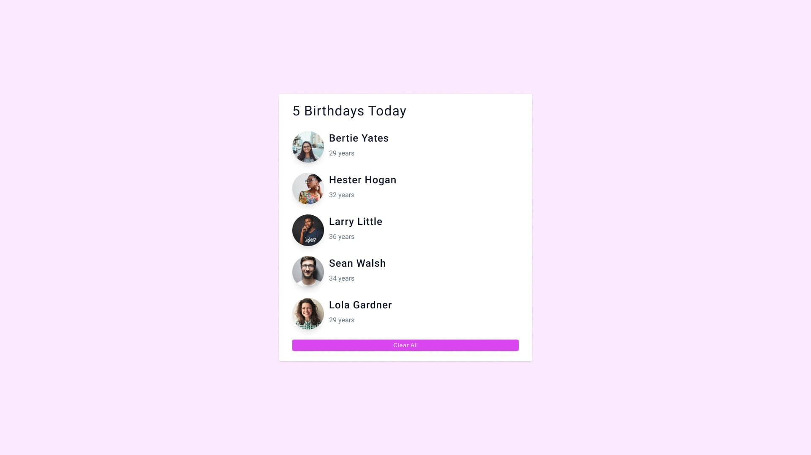

# BIRTYHDAY BUDDY

## Steps

#### Import Data

In App.jsx, import the data (from data.js) to be rendered as an array of objects. Each object should represent a person and contain properties such as name, age, and image URL.

#### Setup State Variable

Then, set up the data as a state variable using the useState hook. This will allow the data to be modified and have those changes automatically reflected in the rendered output.

#### Iterate and Render

Display the number of items in the list by using the length property of the state variable. This information can be displayed using plain text or added to a message or heading element.

To render the list of people, iterate over the data array using the map method. For each item in the array, render an image element (hint : use inline styles to make width smaller).Additionally, render the person's name and age as plain text.

Create a List component to hold the rendered items. This component can be a simple div element containing the list of Person components.

Create a Person component to render the information for each person. This component should receive the person data as props and render the image, name, and age information.

#### Clear List

In App.jsx, add a button to clear the list, and set up the functionality by defining a function that resets the state variable to an empty array.

Overall, the flow of the application should look something like this:

- Import the data you want to render in App.jsx.
- Set up the data as a state variable using useState.
- Use the map method to iterate over the data array and render a Person component for each person.
- Each Person component should render an image with a style prop to control the width, the person's name, and the person's age.
- Create a List component that holds the rendered items.
- Create a button with functionality to clear the list.
- Display the number of items in the list using the length property of the state variable. This can be rendered using plain text or added to a message or heading element.

## Author

- Portfolio - [@mraditya1999](https://adityayadav-dev.netlify.app)
- Twitter - [@mraditya1999](https://twitter.com/mraditya1999)
- Linkedin - [@mraditya1999](https://www.linkedin.com/in/mraditya1999/)
- Medium - [@mraditya1999](https://medium.com/@mraditya1999)
- Frontend Mentor - [@mraditya1999](https://www.frontendmentor.io/profile/Aditya-oss-creator)
