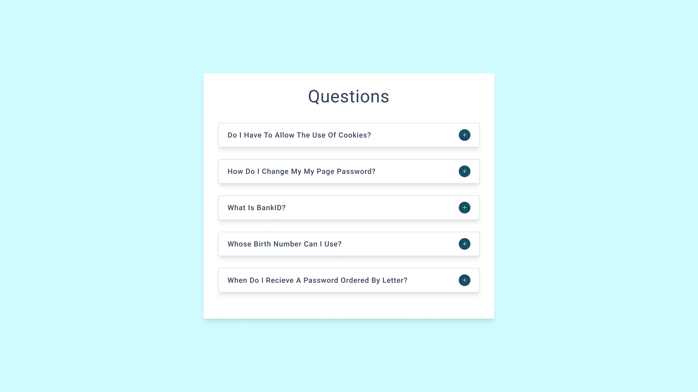

# ACCORDION

## Steps

#### Examine and Import Data

Review data.js and import the questions array from data.js into your project. This array should contain objects that represent the questions and their associated data, such as the question text

#### Setup State Value

Next, set up the questions array as a state variable using the useState hook. This will allow you to modify the data and have those changes automatically reflected in the rendered output.

#### Render Questions

To display the list of questions, you can iterate over the questions array and render a SingleQuestion component for each item in the array. Each SingleQuestion component should display the question text in the header, along with a button to toggle the question text.

#### Toggle Question

In the SingleQuestion component, you can set up the functionality for the toggle button by defining a function that toggles the state of a "showInfo" flag. When the flag is set to true, the answer text will be displayed. When the flag is set to false, only the question text will be displayed.

#### Extra Challenge

To set up the functionality where only one question is displayed at a time, you can modify the state of the questions array to keep track of the currently selected question. You can do this by defining a function that updates the state to reflect the selected question index. Then, you can use the selected question index to render only the SingleQuestion component that corresponds to the currently selected question.

Overall, the flow of the application should look something like this:

- Import the questions array from data.js into your project.
- Set up the questions array as a state variable using the useState hook.
- Iterate over the questions array and render a SingleQuestion component for each item in the array.
- In the SingleQuestion component, display the question text in the header and a button to toggle the question text.
- Define a function that toggles the state of a "showAnswer" flag, which determines whether the answer text is displayed or not.
- Modify the state of the questions array to keep track of the currently selected question index.
- Define a function that updates the state to reflect the selected question index.
- Use the selected question index to render only the SingleQuestion component that corresponds to the currently selected question.

## Author

- Portfolio - [@mraditya1999](https://www.adityayadav.live)
- Twitter - [@mraditya1999](https://twitter.com/mraditya1999)
- Linkedin - [@mraditya1999](https://www.linkedin.com/in/mraditya1999/)
- Medium - [@mraditya1999](https://medium.com/@mraditya1999)
- Frontend Mentor - [@mraditya1999](https://www.frontendmentor.io/profile/Aditya-oss-creator)
