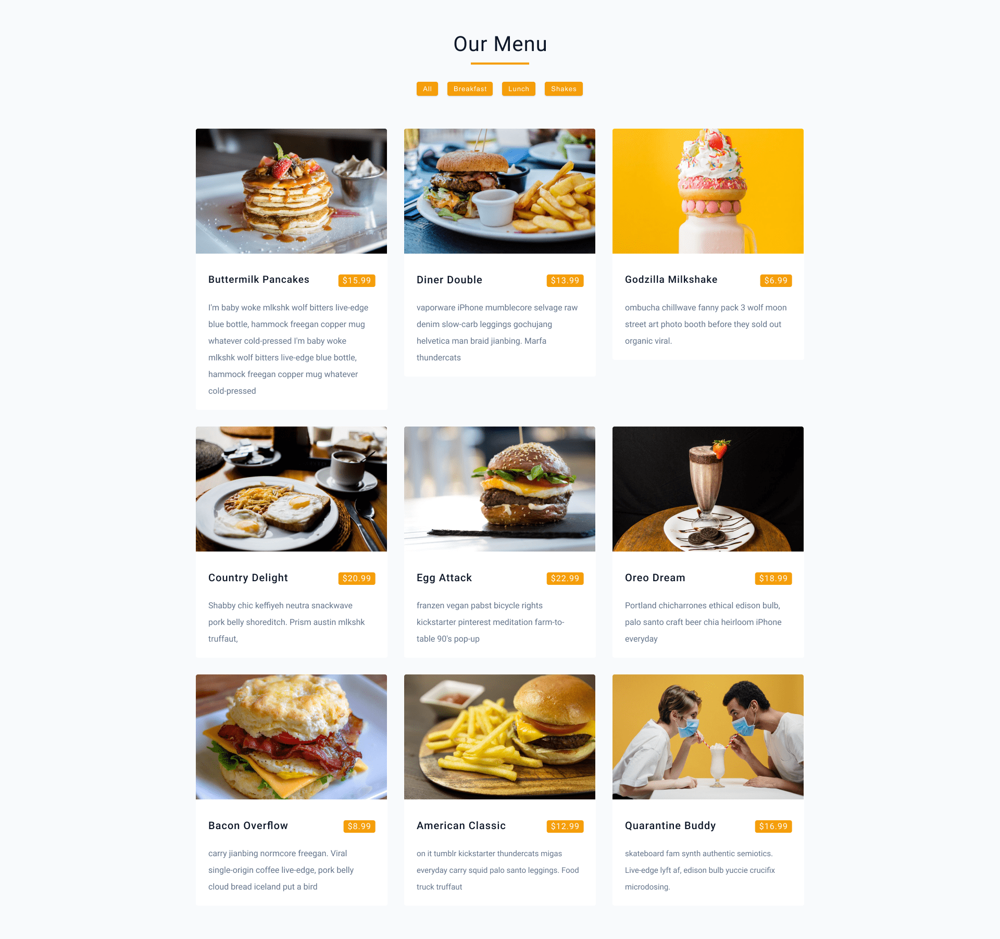

# MENU

[](https://react-05-menus.netlify.app)

## Steps

#### Title Component

First, you need to create a Title component to display the main title of your app. This component can be a simple function that returns a heading element with the app title.

#### Explore and Import Data

Import the menu items data from data.js into your project. This data should be an array of objects, with each object representing a menu item and containing properties such as title, price, image URL, and description.

#### State Value

Set up the menu items data as a state variable in the App.jsx component using the useState hook. This will allow you to modify the data and have those changes automatically reflected in the rendered output.

#### Render Items

Pass the menu items state value down to the Menu.jsx component. In the Menu component, iterate over the list of menu items using the map method, and for every item, render a MenuItem component.

In the MenuItem component, render an image element, a title, a price, and a description. You can use the data from the menu items array to fill in the information for each component.

#### Unique Categories

In the App.jsx component, set up functionality to get only the unique categories from the menu items data and store them in a separate array. Add an "all" category to this array to display all menu items.
Hint : new Set ()
You can find more info on Set Object below after all steps.

#### State Value and Render Categories

Set up the categories array as a state variable in the App.jsx component using the useState hook. This will allow you to modify the data and have those changes automatically reflected in the rendered output.

Create a Categories component and pass the categories state value down to this component. In the Categories component, iterate over the categories array and render buttons for each category.

#### Filter Functionality

Set up filter functionality where once the user clicks on the button, only the menu items that belong to the selected category are displayed. To do this, define a function that takes a category as a parameter and updates the state to show only the menu items that belong to that category. You can then pass this function down to the Categories component as a prop, and attach it to the buttons.

When the user clicks on a category button, the filter function should be called with the selected category as a parameter. The function should then update the state to show only the menu items that belong to the selected category.

Overall, the flow of the application should look something like this:

- Create a Title component to display the app title.
- Import the menu items data from data.js into your project.
- Set up the menu items data as a state variable in the App.jsx component.
- Pass the menu items state value down to the Menu.jsx component and render a MenuItem component for each item in the menu items array.
- In the MenuItem component, display the image, title, price, and description.
- Set up functionality to get only the unique categories from the menu items data and store them in a separate array, including an "all" category to display all menu items.
- Set up the categories array as a state variable in the App.jsx component.
- Create a Categories component and render a button for each category in the categories array.
- Define a function that takes a category as a parameter and updates the state to show only the menu items that belong to that category.
- Attach the filter function to the category buttons in the Categories component.
- Repeat steps 9-10 until the user has selected a different category or chooses to exit the Menu component.

#### Set Object

[JS Nuggets - new Set()](https://www.youtube.com/watch?v=H4NnCItCZWE&list=PLnHJACx3NwAfRUcuKaYhZ6T5NRIpzgNGJ&index=26)

In JavaScript, the Set object is a collection of unique values. It allows you to store values of any type, such as primitive types (numbers, strings, booleans) and object references.

Here's a simple example of using a Set:

```js
// Create a new set
let mySet = new Set();

// Add values to the set
mySet.add(1);
mySet.add(2);
mySet.add(3);

// Add a duplicate value (ignored)
mySet.add(1);

// Get the size of the set (3)
console.log(mySet.size);

// Check if a value is in the set (true)
console.log(mySet.has(2));

// Remove a value from the set
mySet.delete(2);

// Get an array of all values in the set
let myArray = Array.from(mySet);
console.log(myArray); // [1, 3]
```

```js
const tempCategories = menu.map((item) => item.category);
const tempSet = new Set(tempCategories);
const tempItems = ['all', ...tempSet];
console.log(tempItems);
```

## Author

- Portfolio - [@mraditya1999](https://adityayadav-dev.netlify.app)
- Twitter - [@mraditya1999](https://twitter.com/mraditya1999)
- Linkedin - [@mraditya1999](https://www.linkedin.com/in/mraditya1999/)
- Medium - [@mraditya1999](https://medium.com/@mraditya1999)
- Frontend Mentor - [@mraditya1999](https://www.frontendmentor.io/profile/Aditya-oss-creator)
