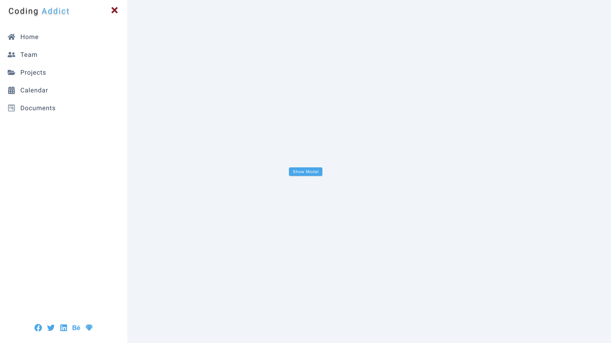

# SIDEBAR AND MODAL

## Steps

#### Create Components

Create three components: Home, Modal, and Sidebar. Render them in App.jsx.

#### Global Context

Setup global context and don't forget to implement a custom hook.

#### Global State Values

Setup two state values, both booleans, isSidebarOpen and isModalOpen. Also, set up four functions to open and close the modal and sidebar. Make all of these values available in the application.

#### Home Component

In Home, set up two buttons and get two functions from global context, openSidebar and openModal. Once the user clicks the button, invoke one of the functions. Set up CSS for the buttons.

#### Modal and Sidebar Component

Create a Modal component and add modal CSS. Repeat the same steps with the Sidebar component.

The flow of the application should look something like this:

- Setup global context and implement a custom hook.

- Setup two state values, both booleans, isSidebarOpen and isModalOpen. Also, set up four functions to open and close the modal and sidebar. Make all of these values available in the application.

- Create three components: Home, Modal, and Sidebar. Render them in App.jsx.

- In Home, set up two buttons and get two functions from global context, openSidebar and openModal. Once the user clicks the button, invoke one of the functions. Set up CSS for the buttons.

- Create a Modal component and add modal CSS. Repeat the same steps with the Sidebar component.

## Author

- Portfolio - [@mraditya1999](https://www.adityayadav.live)
- Twitter - [@mraditya1999](https://twitter.com/mraditya1999)
- Linkedin - [@mraditya1999](https://www.linkedin.com/in/mraditya1999/)
- Medium - [@mraditya1999](https://medium.com/@mraditya1999)
- Frontend Mentor - [@mraditya1999](https://www.frontendmentor.io/profile/Aditya-oss-creator)
