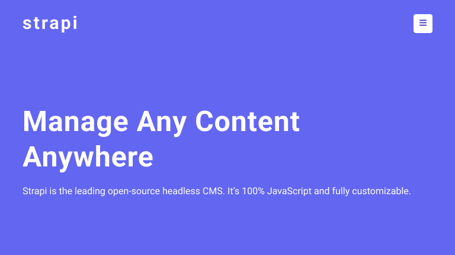
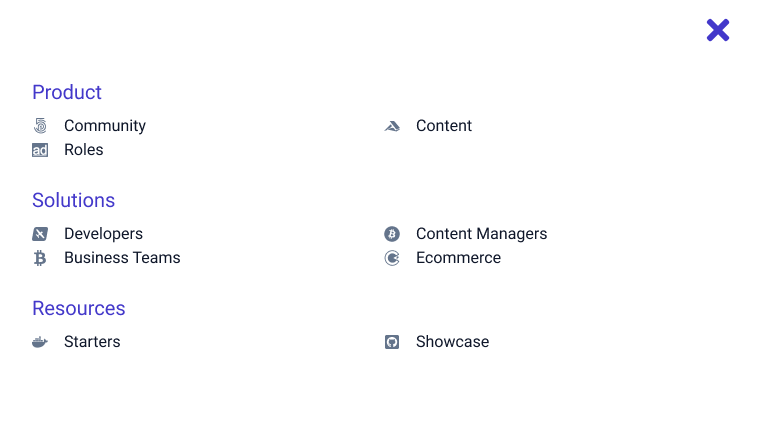
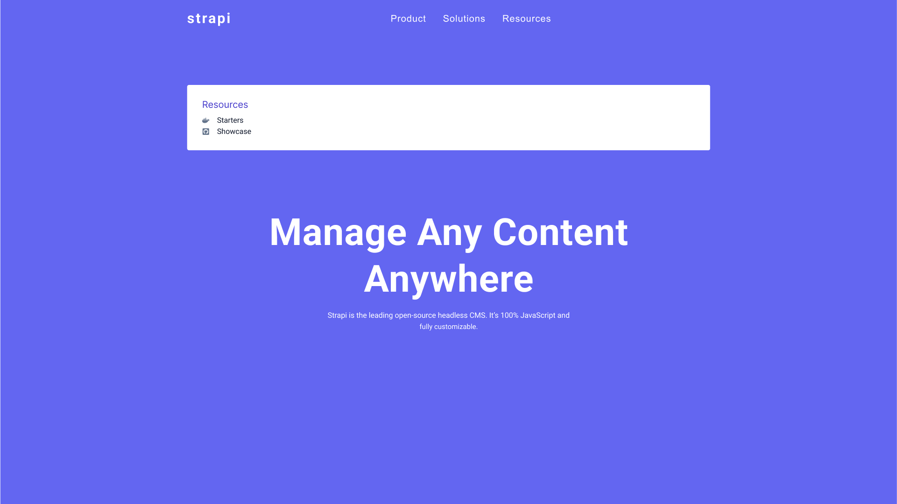

# STRAPI SUBMENU

## Steps

#### Data and Global Context

Explore the data.jsx file. Set up a global context with an isSidebarOpen state value (boolean) and two functions: one to close and the other to open the sidebar. Make all of these values available in the application.

#### Components

Create four components: Navbar, Hero, Sidebar, and Submenu.

#### Navbar

In the Navbar, for now, set up a logo (h3) and a button to open the sidebar. Grab the openSidebar function from the global context. Optionally, you can install and set up an icon from react-icons in the toggle button. Add CSS for the Navbar.

#### Hero

Set up a Hero component and add CSS.

#### Sidebar

In the Sidebar component, import sublinks from data.jsx, iterate over the list, and display links in the component. Set up the Sidebar CSS. Use the isSidebarOpen and closeSidebar functions from the global context to show/hide the sidebar.

#### NavLinks

Set up NavLinks in the Navbar. Import sublinks from data and iterate over them to render pages on the screen. Set up a NavLink CSS.

#### Submenu

Set up a Submenu component with some general CSS. In the global context, set up a pageId with a default value of null and make it available in the app. In the NavLinks component, once the user moves the mouse over the link, set the pageId with the specific page ID. In the Submenu component, grab the pageId from the global context. Based on that ID, get the specific page from sublinks and render the page and links in the submenu. Add CSS to the Submenu component.

#### Edge Cases

Fix multiple edge cases.

The flow of the application should look something like this:

- Explore the data.jsx file. Set up a global context with an isSidebarOpen state value (boolean) and two functions: one to close and the other to open the sidebar. Make all of these values available in the application.

- Create four components: Navbar, Hero, Sidebar, and Submenu.

- In the Navbar, for now, set up a logo (h3) and a button to open the sidebar. Grab the openSidebar function from the global context. Optionally, you can install and set up an icon from react-icons in the toggle button. Add CSS for the Navbar.

- Set up a Hero component and add CSS.

- In the Sidebar component, import sublinks from data.jsx, iterate over the list, and display links in the component. Set up the Sidebar CSS. Use the isSidebarOpen and closeSidebar functions from the global context to show/hide the sidebar.

- Set up NavLinks in the Navbar. Import sublinks from data and iterate over them to render pages on the screen. Set up a NavLink CSS.

- Set up a Submenu component with some general CSS. In the global context, set up a pageId with a default value of null and make it available in the app. In the NavLinks component, once the user moves the mouse over the link, set the pageId with the specific page ID. In the Submenu component, grab the pageId from the global context. Based on that ID, get the specific page from sublinks and render the page and links in the submenu. Add CSS to the Submenu component.

- Fix multiple edge cases.

#### CSS

#### 3D Effect

These lines of CSS are used to apply a 3D transformation to an element on a webpage. Here's what each line does:

transform: rotateX(-90deg) translateX(-50%);
The transform property applies a transformation to an element. In this case, it applies two transformations: rotateX(-90deg) and translateX(-50%).

rotateX(-90deg) rotates the element around the X-axis by -90 degrees, which means it will appear to be flipped upside down.
translateX(-50%) moves the element horizontally by -50% of its own width, effectively shifting it to the left.
Together, these transformations make the element appear to be rotated and tilted, as if it's viewed from above and at an angle.

transform-origin: top;
The transform-origin property specifies the point around which the element should be rotated and transformed. In this case, it's set to top, which means the transformation should be applied around the top edge of the element.

perspective: 1000px;
The perspective property defines the distance between the viewer and the element, and affects the appearance of 3D transformations. In this case, it's set to 1000px, which means the element will appear to be tilted and rotated as if it's viewed from a distance of 1000 pixels.

Overall, these lines of CSS are used to create a 3D effect for an element, making it appear to be tilted and rotated in a particular way.

#### Mouse Events

onMouseEnter: This event is triggered when the mouse cursor enters the target element. It can be used to trigger an action when the user hovers over an element.

onMouseOver: This event is triggered when the mouse cursor is moved over the target element or any of its child elements. It can be used to track the mouse movement and trigger actions accordingly.

onMouseLeave: This event is triggered when the mouse cursor leaves the target element. It can be used to trigger an action when the user stops hovering over an element.

## Author

- Portfolio - [@mraditya1999](https://www.adityayadav.live)
- Twitter - [@mraditya1999](https://twitter.com/mraditya1999)
- Linkedin - [@mraditya1999](https://www.linkedin.com/in/mraditya1999/)
- Medium - [@mraditya1999](https://medium.com/@mraditya1999)
- Frontend Mentor - [@mraditya1999](https://www.frontendmentor.io/profile/Aditya-oss-creator)
