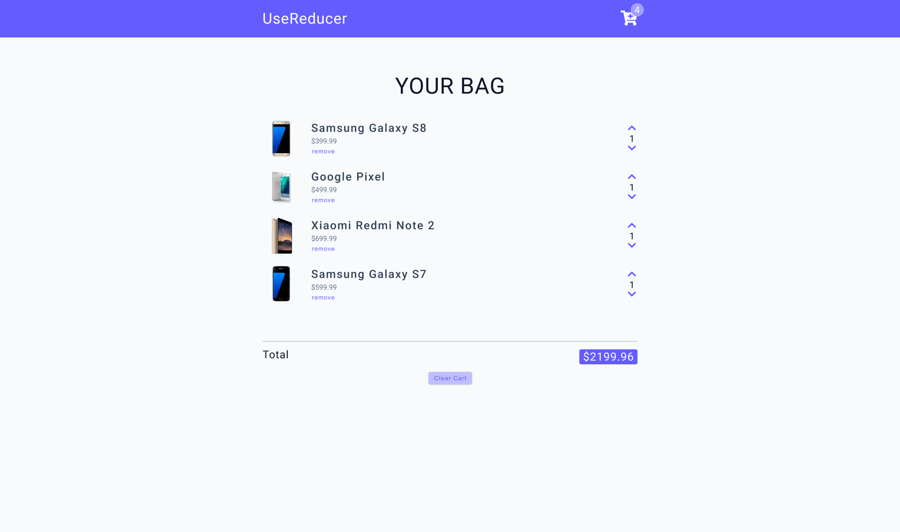

# CART

[](https://react-14-carts.netlify.app)

## Steps

#### Explore

Explore the current application and analyze its functionality.

#### Global Context and useReducer

Set up global context and immediately create a general setup for useReducer. Create two files, one for reducer and one for actions.

#### Cart State Value

In the default state, set cart not as an array but as a new Map().
More info below.

#### Challenge

- setup cart with new Map()
- access and iterate in CartContainer

#### Functionalities

Implement these functionalities in the reducer and actions files, and make them available in the global context.

Clear Cart - an action that clears the entire cart.
Remove Item - an action that removes a specific item from the cart.
Increase Amount - an action that increases the quantity of a specific item in the cart.
Decrease Amount - an action that decreases the quantity of a specific item in the cart.

#### Calculate Totals

Calculate Totals - a function that calculates the total cost of items in the cart.

#### Fetch Data

```js
const url = 'https://www.course-api.com/react-useReducer-cart-project';
```

Fetch Data - an action that fetches data from an API and stores it in the cart state.

#### Test

Test the functionality of the application and fix any issues that arise.

The flow of the application should look something like this:

- Explore the current application and analyze its functionality.
- Set up global context and immediately create a general setup for useReducer. - - Create two files, one for reducer and one for actions.
- In the default state, set cart not as an array but as a new Map().
- Create the following functionalities: Clear Cart, Remove Item, Increase Amount, Decrease Amount, Fetch Data, and Calculate Totals.
- Implement these functionalities in the reducer and actions files, and make them available in the global context.
- Test the functionality of the application and fix any issues that arise

#### Data Structure Options

- array

```js
const cart = [
  { id: 1, name: 'first', price: 10 },
  { id: 2, name: 'second', price: 20 },
];
```

Using an array to store shopping cart data may not be the best option because it can be less efficient for lookups and updates, especially for larger datasets. Arrays are also less flexible than Maps when it comes to associating values with unique identifiers.

- object

```js
const cart = {
  'id-1': { id: 1, name: 'first', price: 10 },
  'id-2': { id: 2, name: 'second', price: 20 },
};
```

The downsides of using an object to store shopping cart data include the risk of unintended property overwriting or unexpected behavior when iterating over inherited properties. Additionally, objects can only use string keys, which can be limiting if you need to use non-string keys. Deleting properties from an object can also be tricky, especially when dealing with inherited properties.

- new Map()

For a shopping cart application, using a new Map() to store the cart data is beneficial because it allows for efficient lookups and updates based on unique product IDs. Using a Map can also ensure that each item in the cart has a unique identifier and can easily be updated or removed without affecting other items in the cart.

#### Map

A Map is a built-in data structure in JavaScript that allows you to store key-value pairs, where both the keys and values can be any data type. Here's a simple example:

```js
// create a new Map instance
const cart = new Map();

// set some key-value pairs

cart.set('apple', { name: 'Apple', price: 0.5, quantity: 3 });
cart.set('banana', { name: 'Banana', price: 0.3, quantity: 6 });
cart.set('orange', { name: 'Orange', price: 0.4, quantity: 4 });

// get the value associated with a key
const appleDetails = cart.get('apple'); // returns { name: 'Apple', price: 0.5, quantity: 3 }

// check if a key exists in the map
const hasPear = cart.has('pear'); // returns false

// get the number of key-value pairs in the map
const size = cart.size; // returns 3

// delete a key-value pair from the map
cart.delete('banana');

// loop over the key-value pairs in the map
for (let [key, { name, price, quantity }] of cart) {
  console.log(key, name, price, quantity); // prints 'apple' 'Apple' 0.5 3, 'banana' 'Banana' 0.3 6, 'orange' 'Orange' 0.4 4
}
```

#### JS Nuggets Video

[Array.from](https://www.youtube.com/watch?v=zg1Bv4xubwo&list=PLnHJACx3NwAfRUcuKaYhZ6T5NRIpzgNGJ&index=11)

#### Converting

```js
const items = [
  { id: 1, name: 'first', price: 10 },
  { id: 2, name: 'second', price: 20 },
];
const cartItems = items.map((item) => [item.id, item]);

console.log(cartItems);
// prints:
// [
//   [1, { id: 1, name: 'first', price: 10 }],
//   [2, { id: 2, name: 'second', price: 20 }],
// ];

// create a new Map instance
const cart = new Map(cartItems);

// convert the Map to an array of key-value pairs
const cartArray = Array.from(cart.entries());

console.log(cartArray);
// prints:
// [
//   [1, { id: 1, name: 'first', price: 10 }],
//   [2, { id: 2, name: 'second', price: 20 }]
// ]
```

## Author

- Portfolio - [@mraditya1999](https://adityayadav-dev.netlify.app)
- Twitter - [@mraditya1999](https://twitter.com/mraditya1999)
- Linkedin - [@mraditya1999](https://www.linkedin.com/in/mraditya1999/)
- Medium - [@mraditya1999](https://medium.com/@mraditya1999)
- Frontend Mentor - [@mraditya1999](https://www.frontendmentor.io/profile/Aditya-oss-creator)
