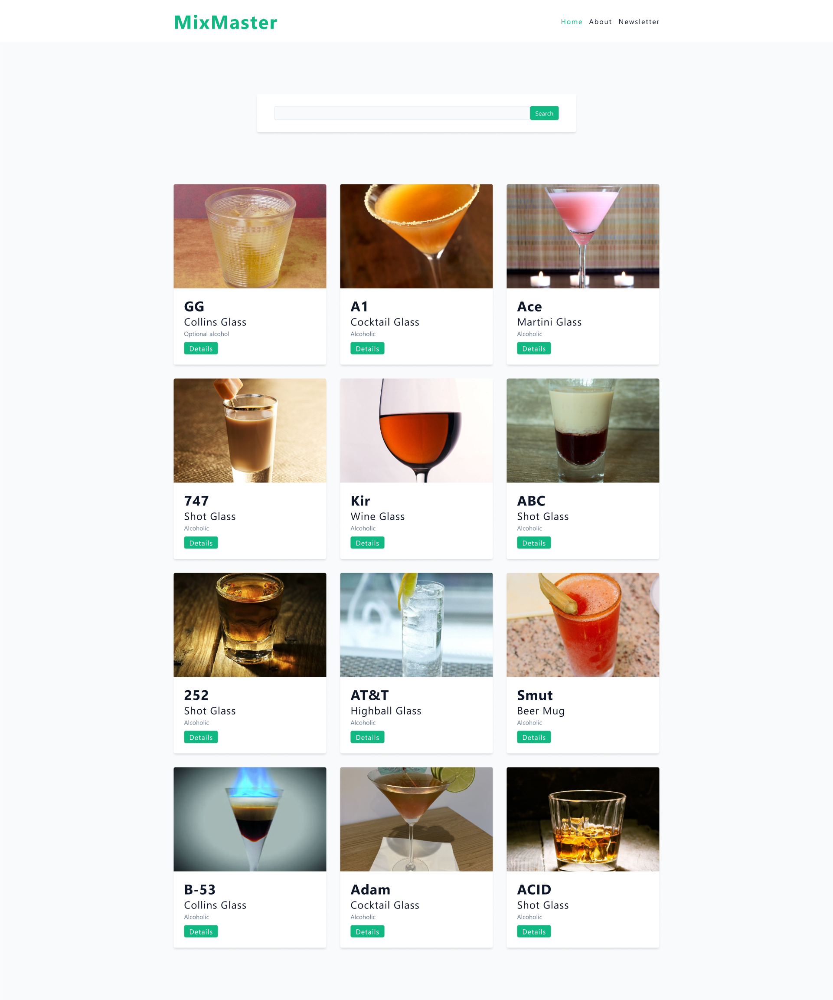
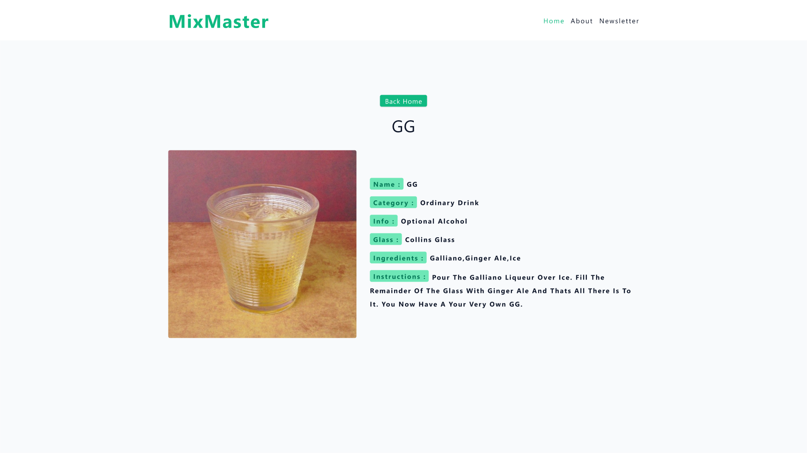
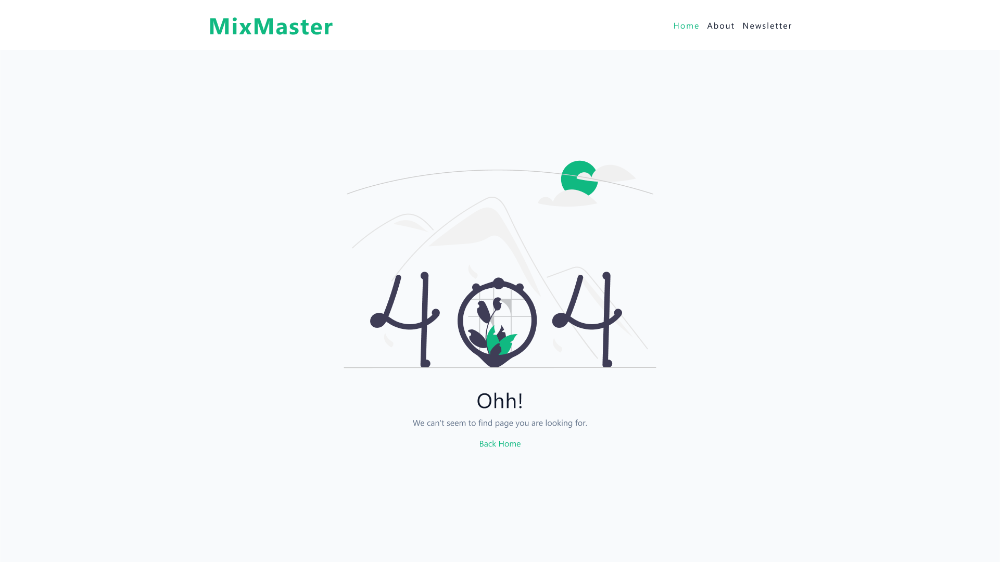

# MIXMASTER

## Steps

#### Install and Setup

- npm install
- npm run dev

React Router is a JavaScript library used in React applications to handle routing and navigation. It provides a declarative way to define the routes of an application and render different components based on the current URL. React Router allows developers to create a seamless, client-side navigation experience within a SPA by mapping URLs to specific components and managing the history and URL changes.

[React Router](https://reactrouter.com/en/main)

#### TheCocktailDB

[API](https://www.thecocktaildb.com/)

- Search cocktail by name
  www.thecocktaildb.com/api/json/v1/1/search.php?s=margarita
- Lookup full cocktail details by id
  www.thecocktaildb.com/api/json/v1/1/lookup.php?i=11007

#### Default Behavior

The "method" attribute in an HTML form specifies the HTTP method to be used when submitting the form data to the server. The two commonly used values for the "method" attribute are:

GET: This is the default method if the "method" attribute is not specified. When the form is submitted with the GET method, the form data is appended to the URL as a query string. The data becomes visible in the URL, which can be bookmarked and shared. GET requests are generally used for retrieving data from the server and should not have any side effects on the server.

POST: When the form is submitted with the POST method, the form data is included in the request payload rather than being appended to the URL. POST requests are typically used when submitting sensitive or large amounts of data to the server, as the data is not directly visible in the URL. POST requests can have side effects on the server, such as updating or inserting data.

- action attribute

  The "action" attribute in an HTML form specifies the URL or destination where the form data should be sent when the form is submitted. It defines the server-side script or endpoint that will receive and process the form data.

If the action attribute is not provided in the HTML form, the browser will send the form data to the current URL, which means it will submit the form to the same page that the form is on. This behavior is referred to as a "self-submitting" form.

#### FormData API

- a great solution when you have bunch of inputs
- inputs must have name attribute

The FormData interface provides a way to construct a set of key/value pairs representing form fields and their values, which can be sent using the fetch() or XMLHttpRequest.send() method. It uses the same format a form would use if the encoding type were set to "multipart/form-data".

#### React Router - Action

Route actions are the "writes" to route loader "reads". They provide a way for apps to perform data mutations with simple HTML and HTTP semantics while React Router abstracts away the complexity of asynchronous UI and revalidation. This gives you the simple mental model of HTML + HTTP (where the browser handles the asynchrony and revalidation) with the behavior and UX capabilities of modern SPAs.

const url = new URL(request.url);
This line of code creates a new URL object using the URL constructor. The URL object represents a URL and provides methods and properties for working with URLs. In this case, the request.url is passed as an argument to the URL constructor to create a new URL object called url.

The request.url is an input parameter representing the URL of an incoming HTTP request. By creating a URL object from the provided URL, you can easily extract specific components and perform operations on it.

const searchTerm = url.searchParams.get('search') || '';
This line of code retrieves the value of the search parameter from the query string of the URL. The searchParams property of the URL object provides a URLSearchParams object, which allows you to access and manipulate the query parameters of the URL.

The get() method of the URLSearchParams object retrieves the value of a specific parameter by passing its name as an argument. In this case, 'search' is passed as the parameter name. If the search parameter exists in the URL's query string, its value will be assigned to the searchTerm variable. If the search parameter is not present or its value is empty, the expression '' (an empty string) is assigned to searchTerm using the logical OR operator (||).

## Author

- Portfolio - [@mraditya1999](https://adityayadav-dev.netlify.app)
- Twitter - [@mraditya1999](https://twitter.com/mraditya1999)
- Linkedin - [@mraditya1999](https://www.linkedin.com/in/mraditya1999/)
- Medium - [@mraditya1999](https://medium.com/@mraditya1999)
- Frontend Mentor - [@mraditya1999](https://www.frontendmentor.io/profile/Aditya-oss-creator)
