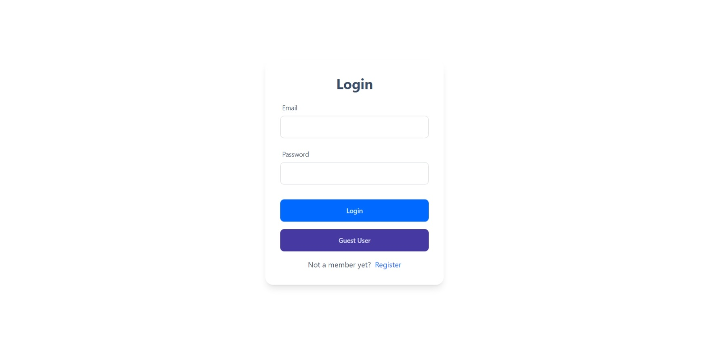
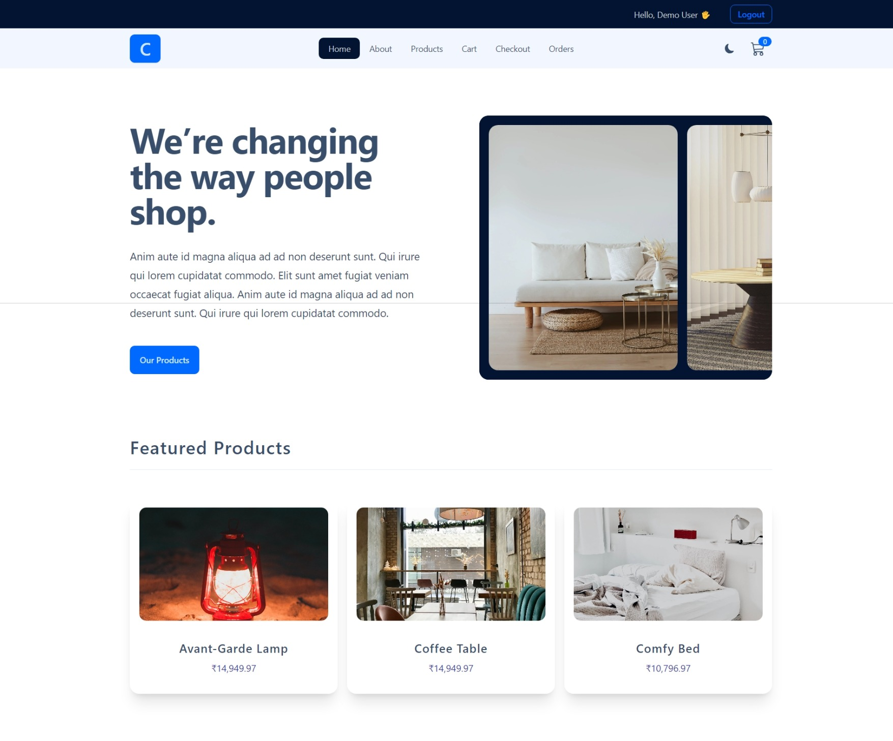
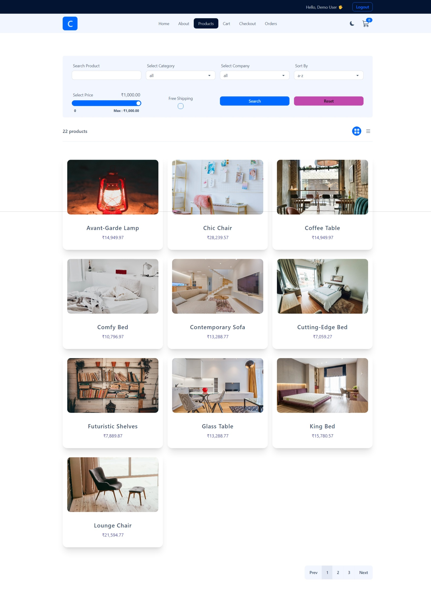
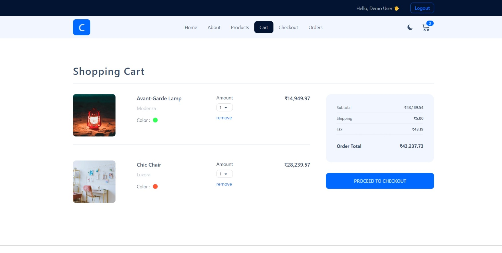

# COMFY STORE (E-COMMERCE)

This project is an e-commerce website built with React, TailwindCSS, DaisyUI, Redux, Axios, and React Query. The website sells furniture and includes features like pagination, add to cart, search and filter.

## Features

- **Pagination**: Allows users to navigate through multiple pages of products.
- **Add to Cart**: Users can add products to their shopping cart.
- **Search**: Users can search products of their choice.
- **Filter**: Users can filter products based on various criteria.

## Technologies Used

- **React**: A JavaScript library for building user interfaces.
- **TailwindCSS & DaisyUI**: Used for styling the application.
- **Redux**: A predictable state container for JavaScript apps.
- **Axios**: Promise based HTTP client for the browser and node.js.
- **React Query**: Fetch, cache and update data in your React and React Native applications all without touching any "global state".

## Getting Started

These instructions will get you a copy of the project up and running on your local machine for development and testing purposes.

## How to Run Locally

1. Clone the repository to your local machine.
2. Navigate to the project directory.
3. Install the required dependencies with `npm install`.
4. Start the development server with `npm start`.
5. Open [http://localhost:3000](http://localhost:3000) to view the app in your browser.

## Author

- Portfolio - [@mraditya1999](https://adityayadav-dev.netlify.app)
- Twitter - [@mraditya1999](https://twitter.com/mraditya1999)
- Linkedin - [@mraditya1999](https://www.linkedin.com/in/mraditya1999/)
- Medium - [@mraditya1999](https://medium.com/@mraditya1999)
- Frontend Mentor - [@mraditya1999](https://www.frontendmentor.io/profile/Aditya-oss-creator)
