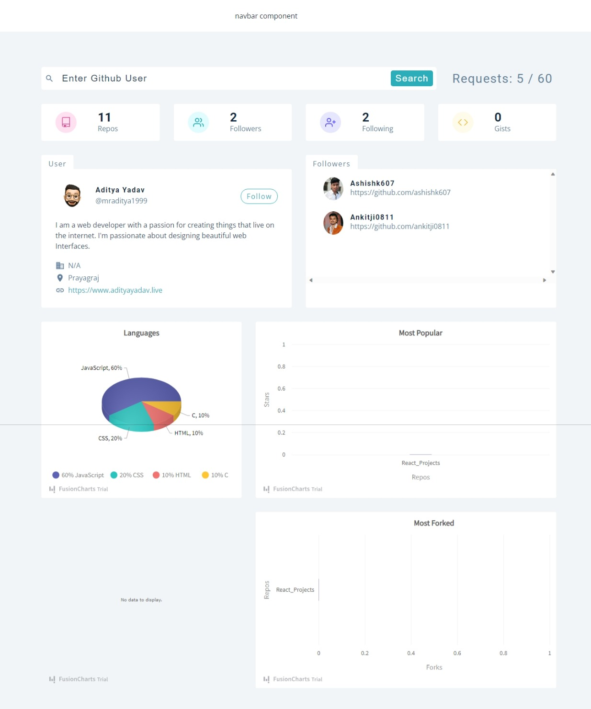

# Github User Search - React + Tailwind CSS

[](https://react-25-github-user-search.netlify.app)

This project is a Github User Search application built using React.js and the Github API.

## Features

- Search Github users by username
- View user details including public repos, followers, following, and more
- Responsive design

## Getting Started

These instructions will get you a copy of the project up and running on your local machine for development and testing purposes.

### Prerequisites

- Node.js installed on your local system
- NPM (Node Package Manager) installed on your local system

### Installation

```bash
# clone the repository
git clone https://github.com/your-repo/github-user-search.git

# Navigate to the project directory
cd github-user-search

# Install the project dependencies
npm install

# Start the application
npm start

```

## Gihthub API

- [Root Endpoint](https://api.github.com)
- [Get User](https://api.github.com/users/wesbos)
- [Repos](https://api.github.com/users/john-smilga/repos?per_page=100)
- [Followers](https://api.github.com/users/john-smilga/followers)
- [Rate Limit](https://api.github.com/rate_limit)

  For unauthenticated requests, the rate limit allows for up to 60 requests per hour. Unauthenticated requests are associated with the originating IP address, and not the user making requests.

## Fusion Charts

- [Fusion Charts - Main Docs](https://www.fusioncharts.com/)
- [First React Chart](https://www.fusioncharts.com/dev/getting-started/react/your-first-chart-using-react)
- [List Of Charts](https://www.fusioncharts.com/dev/chart-guide/list-of-charts)
- [Themes](https://www.fusioncharts.com/dev/themes/introduction-to-themes)

## Auth0

- [Auth0 - Main Docs](https://auth0.com/)

- Create Application
- Choose : Single Page Web Applications
- Choose : React
- Go to Settings Tab
- Copy/Paste Domain, ClientID - can be public (or use .env)
- Add Domain -
  for now http://localhost:3000 (DON'T COPY PASTE FROM URL BAR)

  - Allowed Callback URLs
  - Allowed Logout URLs
  - Allowed Web Origins
  - SAVE CHANGES!!!!!!!!!!!!!!!

- Connections
  email,social

- [React SDK Docs](https://auth0.com/docs/libraries/auth0-react)
- [REACT SDK API Docs](https://auth0.github.io/auth0-react/)

## Deployment

[Netlify](https://www.netlify.com/)

## Additional Info

#### Redirects with react-router-dom

In order for routing to work on netlify, redirects was added to the public folder

- \_redirects file in public

```

/*    /index.html   200
```

## Author

- Portfolio - [@mraditya1999](https://www.adityayadav.live)
- Twitter - [@mraditya1999](https://twitter.com/mraditya1999)
- Linkedin - [@mraditya1999](https://www.linkedin.com/in/mraditya1999/)
- Medium - [@mraditya1999](https://medium.com/@mraditya1999)
- Frontend Mentor - [@mraditya1999](https://www.frontendmentor.io/profile/Aditya-oss-creator)
