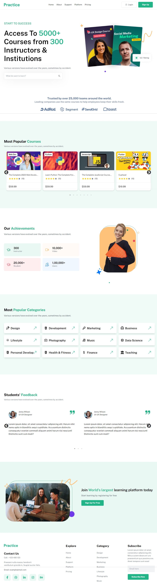

# LMS LANDING PAGE - React + Tailwind CSS

[](https://react-25-lms-landing-page.netlify.app)

This project is a Learning Management System (LMS) landing page built using React and Tailwind CSS.

## Features

- Responsive design
- Modern UI/UX
- Fast loading times

## Getting Started

These instructions will get you a copy of the project up and running on your local machine for development and testing purposes.

### Prerequisites

- Node.js installed on your local system
- NPM (Node Package Manager) installed on your local system

### Installation

Follow these steps to get the project up and running on your local machine:

```bash
# Clone the repository
git clone https://github.com/your-repo/password-generator.git

# Navigate to the project directory
cd password-generator

# Install the project dependencies
npm install

# Start the application
npm start

```

## Author

- Portfolio - [@mraditya1999](https://adityayadav-dev.netlify.app)
- Twitter - [@mraditya1999](https://twitter.com/mraditya1999)
- Linkedin - [@mraditya1999](https://www.linkedin.com/in/mraditya1999/)
- Medium - [@mraditya1999](https://medium.com/@mraditya1999)
- Frontend Mentor - [@mraditya1999](https://www.frontendmentor.io/profile/Aditya-oss-creator)
