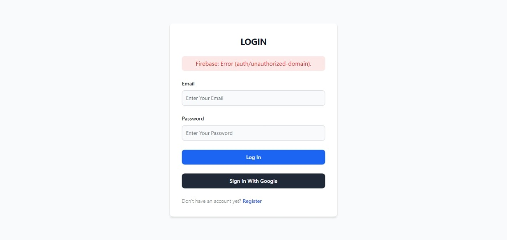
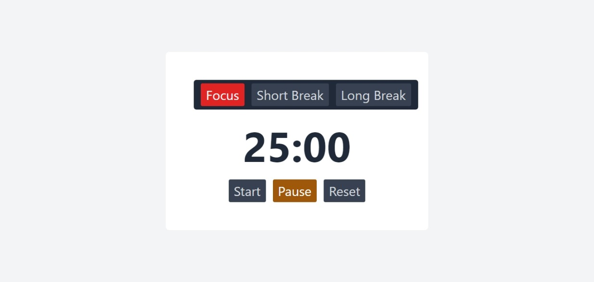

# POMODORO TIMER APP

This is a simple Pomodoro Timer app, designed to help you manage your time effectively and increase your productivity. The app is built with modern technologies and follows the Pomodoro Technique, a time management method.

## Features

- Set your own work and break intervals.
- After signing in with your Google account, you can start using the Pomodoro Timer.

## Technologies Used

- React.js
- Tailwind CSS for styling
- Firebase Authentication: Securely sign in with your Google account.

## Getting Started

These instructions will get you a copy of the project up and running on your local machine for development and testing purposes.

## How to Run Locally

1. Clone the repository to your local machine.
2. Navigate to the project directory.
3. Install the required dependencies with `npm install`.
4. Start the development server with `npm start`.
5. Open [http://localhost:3000](http://localhost:3000) to view the app in your browser.

## Author

- Portfolio - [@mraditya1999](https://www.adityayadav.live)
- Twitter - [@mraditya1999](https://twitter.com/mraditya1999)
- Linkedin - [@mraditya1999](https://www.linkedin.com/in/mraditya1999/)
- Medium - [@mraditya1999](https://medium.com/@mraditya1999)
- Frontend Mentor - [@mraditya1999](https://www.frontendmentor.io/profile/Aditya-oss-creator)
