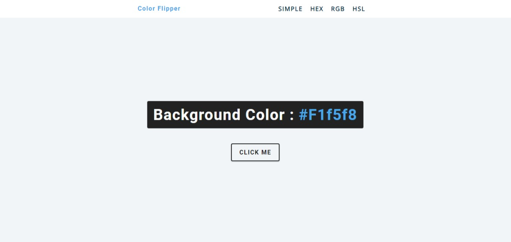

# COLOR FLIPPER

[](https://react-28-color-flipper.netlify.app)

Color Flipper is a simple React application that allows users to generate random colors.

## Features

- Navigation using `react-router-dom`
- Generation of multiple color values: static, hex, hsl, rgb

## Installation

```bash
git clone https://github.com/your-repo/color-flipper.git
cd color-flipper
npm install
npm start
```

## Author

- Portfolio - [@mraditya1999](https://adityayadav-dev.netlify.app)
- Twitter - [@mraditya1999](https://twitter.com/mraditya1999)
- Linkedin - [@mraditya1999](https://www.linkedin.com/in/mraditya1999/)
- Medium - [@mraditya1999](https://medium.com/@mraditya1999)
- Frontend Mentor - [@mraditya1999](https://www.frontendmentor.io/profile/Aditya-oss-creator)
