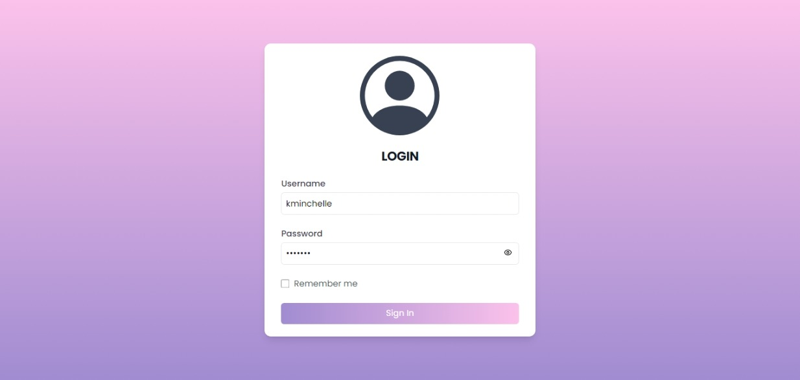
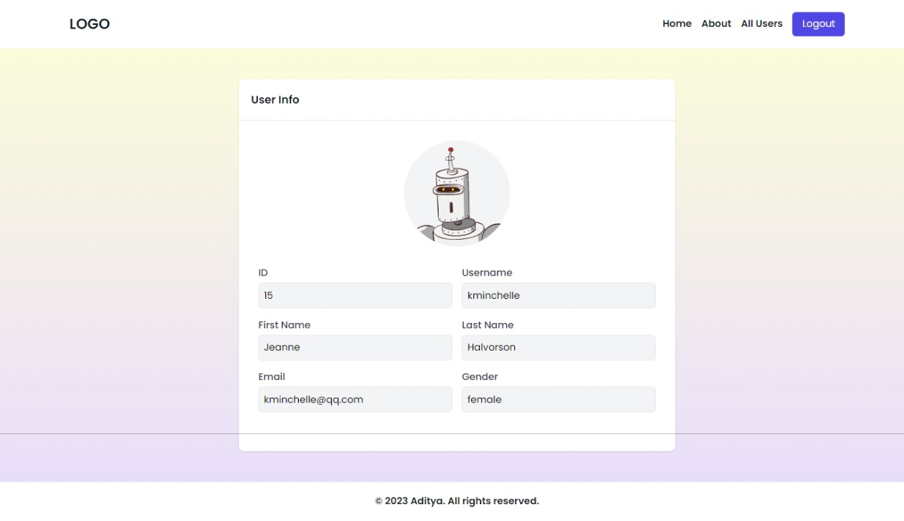
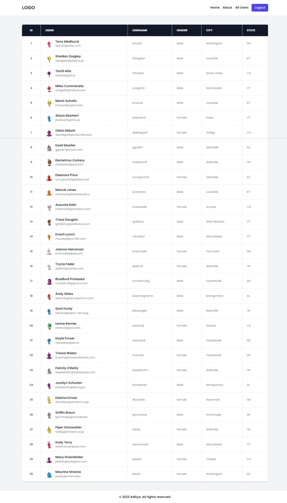

# Login App

This form built with React and Redux. It uses a dummy login API for authentication, making it a great starting point for testing or building out a larger application.

## Tools and Technologies Used

- **React**: A JavaScript library for building user interfaces.
- **React Router**: Declarative routing for React.
- **Redux Toolkit**: The official, opinionated, batteries-included toolset for efficient Redux development.
- **Axios**: Promise based HTTP client for the browser and node.js.
- **react-icons**: Utilize ES6 imports that allows you to include only the icons that your project is using.

## Getting Started

These instructions will get you a copy of the project up and running on your local machine for development and testing purposes.

## How to Run Locally

1. Clone the repository to your local machine.
2. Navigate to the project directory.
3. Install the required dependencies with `npm install`.
4. Start the development server with `npm start`.
5. Open [http://localhost:3000](http://localhost:3000) to view the app in your browser.

## Author

- Portfolio - [@mraditya1999](https://adityayadav-dev.netlify.app)
- Twitter - [@mraditya1999](https://twitter.com/mraditya1999)
- Linkedin - [@mraditya1999](https://www.linkedin.com/in/mraditya1999/)
- Medium - [@mraditya1999](https://medium.com/@mraditya1999)
- Frontend Mentor - [@mraditya1999](https://www.frontendmentor.io/profile/Aditya-oss-creator)
