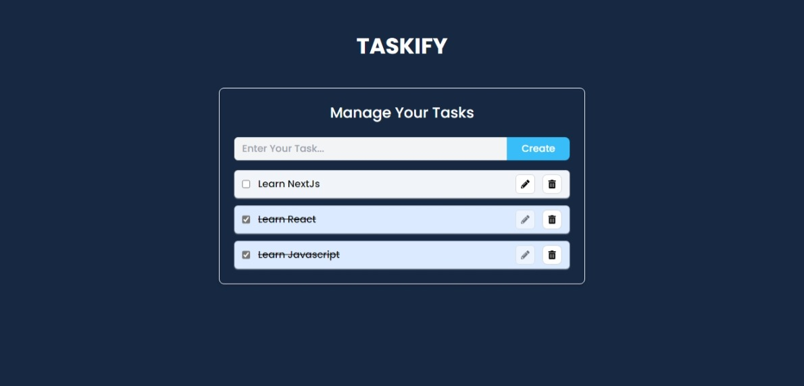

# TASKIFY APP

This is a comprehensive Todo App, designed to manage your daily tasks. The app is built with modern technologies and provides a user-friendly interface.

## Technologies Used

- React.js
- Tailwind CSS
- Context API

## Getting Started

These instructions will get you a copy of the project up and running on your local machine for development and testing purposes.

## How to Run Locally

1. Clone the repository to your local machine.
2. Navigate to the project directory.
3. Install the required dependencies with `npm install`.
4. Start the development server with `npm start`.
5. Open [http://localhost:3000](http://localhost:3000) to view the app in your browser.

## Author

- Portfolio - [@mraditya1999](https://www.adityayadav.live)
- Twitter - [@mraditya1999](https://twitter.com/mraditya1999)
- Linkedin - [@mraditya1999](https://www.linkedin.com/in/mraditya1999/)
- Medium - [@mraditya1999](https://medium.com/@mraditya1999)
- Frontend Mentor - [@mraditya1999](https://www.frontendmentor.io/profile/Aditya-oss-creator)
